## Dependency


```python
import numpy as np
import pandas as pd
import matplotlib.pyplot as plt
import seaborn as sns
sns.set(style="white")


from sklearn.model_selection import train_test_split
from sklearn.linear_model import LinearRegression,Ridge,Lasso,RidgeCV
from sklearn.ensemble import RandomForestRegressor,BaggingRegressor,GradientBoostingRegressor,AdaBoostRegressor
from sklearn.neighbors import KNeighborsRegressor
from sklearn.metrics import r2_score
```

## Load Dataset


```python
train = pd.read_csv("train.csv")
test = pd.read_csv("test.csv")
```


```python
train.columns
```


    Index(['datetime', 'season', 'holiday', 'workingday', 'weather', 'temp',
           'atemp', 'humidity', 'windspeed', 'casual', 'registered', 'count'],
          dtype='object')


```python
test.columns
```


    Index(['datetime', 'season', 'holiday', 'workingday', 'weather', 'temp',
           'atemp', 'humidity', 'windspeed'],
          dtype='object')


## 결측치확인

 - 결측치 없음


```python
train.isnull().sum()
```


    datetime      0
    season        0
    holiday       0
    workingday    0
    weather       0
    temp          0
    atemp         0
    humidity      0
    windspeed     0
    casual        0
    registered    0
    count         0
    dtype: int64


```python
test.isnull().sum()
```


    datetime      0
    season        0
    holiday       0
    workingday    0
    weather       0
    temp          0
    atemp         0
    humidity      0
    windspeed     0
    dtype: int64


```python
train.describe()
```


<div>
<style scoped>
    .dataframe tbody tr th:only-of-type {
        vertical-align: middle;
    }

    .dataframe tbody tr th {
        vertical-align: top;
    }

    .dataframe thead th {
        text-align: right;
    }
</style>
<table border="1" class="dataframe">
  <thead>
    <tr style="text-align: right;">
      <th></th>
      <th>season</th>
      <th>holiday</th>
      <th>workingday</th>
      <th>weather</th>
      <th>temp</th>
      <th>atemp</th>
      <th>humidity</th>
      <th>windspeed</th>
      <th>casual</th>
      <th>registered</th>
      <th>count</th>
    </tr>
  </thead>
  <tbody>
    <tr>
      <th>count</th>
      <td>10886.000000</td>
      <td>10886.000000</td>
      <td>10886.000000</td>
      <td>10886.000000</td>
      <td>10886.00000</td>
      <td>10886.000000</td>
      <td>10886.000000</td>
      <td>10886.000000</td>
      <td>10886.000000</td>
      <td>10886.000000</td>
      <td>10886.000000</td>
    </tr>
    <tr>
      <th>mean</th>
      <td>2.506614</td>
      <td>0.028569</td>
      <td>0.680875</td>
      <td>1.418427</td>
      <td>20.23086</td>
      <td>23.655084</td>
      <td>61.886460</td>
      <td>12.799395</td>
      <td>36.021955</td>
      <td>155.552177</td>
      <td>191.574132</td>
    </tr>
    <tr>
      <th>std</th>
      <td>1.116174</td>
      <td>0.166599</td>
      <td>0.466159</td>
      <td>0.633839</td>
      <td>7.79159</td>
      <td>8.474601</td>
      <td>19.245033</td>
      <td>8.164537</td>
      <td>49.960477</td>
      <td>151.039033</td>
      <td>181.144454</td>
    </tr>
    <tr>
      <th>min</th>
      <td>1.000000</td>
      <td>0.000000</td>
      <td>0.000000</td>
      <td>1.000000</td>
      <td>0.82000</td>
      <td>0.760000</td>
      <td>0.000000</td>
      <td>0.000000</td>
      <td>0.000000</td>
      <td>0.000000</td>
      <td>1.000000</td>
    </tr>
    <tr>
      <th>25%</th>
      <td>2.000000</td>
      <td>0.000000</td>
      <td>0.000000</td>
      <td>1.000000</td>
      <td>13.94000</td>
      <td>16.665000</td>
      <td>47.000000</td>
      <td>7.001500</td>
      <td>4.000000</td>
      <td>36.000000</td>
      <td>42.000000</td>
    </tr>
    <tr>
      <th>50%</th>
      <td>3.000000</td>
      <td>0.000000</td>
      <td>1.000000</td>
      <td>1.000000</td>
      <td>20.50000</td>
      <td>24.240000</td>
      <td>62.000000</td>
      <td>12.998000</td>
      <td>17.000000</td>
      <td>118.000000</td>
      <td>145.000000</td>
    </tr>
    <tr>
      <th>75%</th>
      <td>4.000000</td>
      <td>0.000000</td>
      <td>1.000000</td>
      <td>2.000000</td>
      <td>26.24000</td>
      <td>31.060000</td>
      <td>77.000000</td>
      <td>16.997900</td>
      <td>49.000000</td>
      <td>222.000000</td>
      <td>284.000000</td>
    </tr>
    <tr>
      <th>max</th>
      <td>4.000000</td>
      <td>1.000000</td>
      <td>1.000000</td>
      <td>4.000000</td>
      <td>41.00000</td>
      <td>45.455000</td>
      <td>100.000000</td>
      <td>56.996900</td>
      <td>367.000000</td>
      <td>886.000000</td>
      <td>977.000000</td>
    </tr>
  </tbody>
</table>
</div>


### Data 확인

**season별 대여량**


```python
sns.factorplot(x='season',data=train,kind='count',size=5,aspect=1.5)
```

    C:\ProgramData\Anaconda3\lib\site-packages\seaborn\categorical.py:3666: UserWarning: The `factorplot` function has been renamed to `catplot`. The original name will be removed in a future release. Please update your code. Note that the default `kind` in `factorplot` (`'point'`) has changed `'strip'` in `catplot`.
      warnings.warn(msg)
    C:\ProgramData\Anaconda3\lib\site-packages\seaborn\categorical.py:3672: UserWarning: The `size` paramter has been renamed to `height`; please update your code.
      warnings.warn(msg, UserWarning)
    


    <seaborn.axisgrid.FacetGrid at 0x89a19e8>


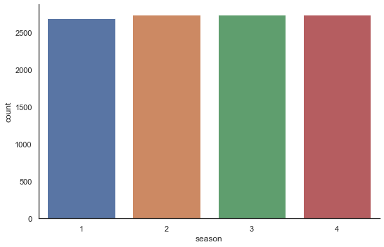


**휴일별대여량**
- 대부분의 데이터는 근무일의 데이터를 기반으로 하고있음


```python
sns.factorplot(x='holiday',data=train,kind='count',size=5,aspect=1)
```


    <seaborn.axisgrid.FacetGrid at 0xb8b3128>


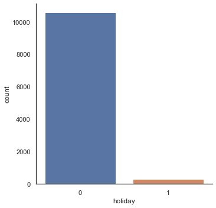


**날씨별 대여량 확인**


```python
sns.factorplot(x='weather',data=train,kind='count',size=5,aspect=1)  
# 1-> 봄
# 2-> 여름
# 3-> 가을
# 4-> 겨울
```


    <seaborn.axisgrid.FacetGrid at 0xbce6be0>


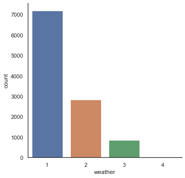


**기타 데이터의 분포확인**


```python
sns.boxplot(data=train[['temp','atemp', 'humidity', 'windspeed']])
fig=plt.gcf()
fig.set_size_inches(10,10)
```


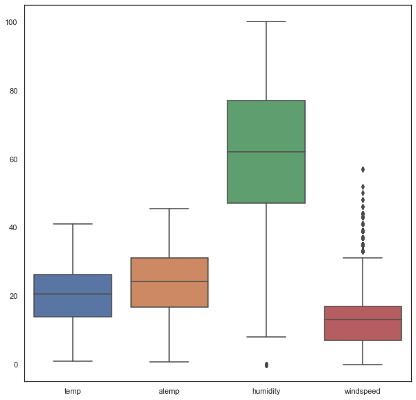


```python
sns.boxplot(data=train[[ 'casual', 'registered', 'count']])
fig=plt.gcf()
fig.set_size_inches(10,10)
```


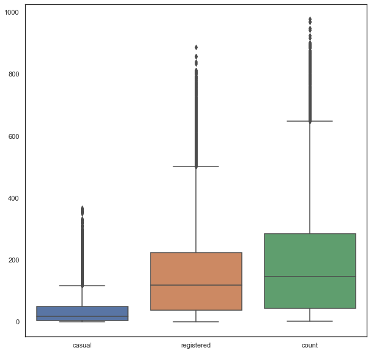


**독립변수별 분산**


```python
fig,axes=plt.subplots(2,2)
axes[0,0].hist(x="temp",data=train,edgecolor="black",linewidth=2)
axes[0,0].set_title("Variation of temp")
axes[0,1].hist(x="atemp",data=train,edgecolor="black",linewidth=2)
axes[0,1].set_title("Variation of atemp")
axes[1,0].hist(x="windspeed",data=train,edgecolor="black",linewidth=2)
axes[1,0].set_title("Variation of windspeed")
axes[1,1].hist(x="humidity",data=train,edgecolor="black",linewidth=2)
axes[1,1].set_title("Variation of humidity")
fig.set_size_inches(10,10)
```


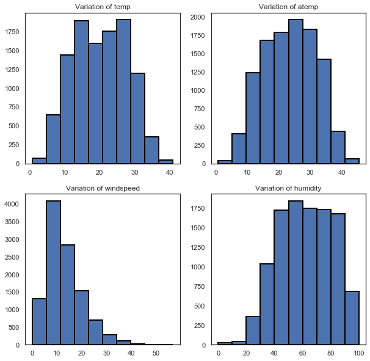


### HeatMap 
 - temp 변수와 atemp변수는 예상대로 강한 상관관계를 가지고 있음
 - humitity 변수는 대여량과 음의 상관관계를 가지고 있음


```python
fig=plt.gcf()
fig.set_size_inches(12,12)
sns.heatmap(train.corr(), square=True,annot=True,cbar=True)
```


    <matplotlib.axes._subplots.AxesSubplot at 0xc26c4e0>


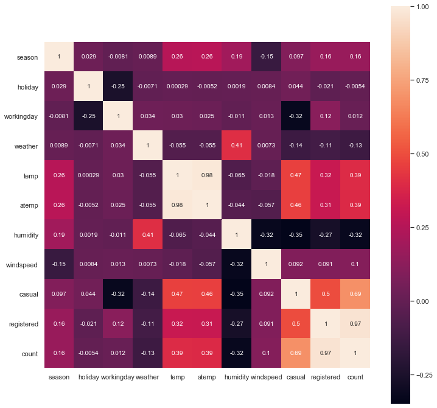


## 명목형 데이터 One-Hot 처리


```python
season = pd.get_dummies(train['season'], prefix='season')
train=pd.concat([train,season],axis=1)
season = pd.get_dummies(test['season'], prefix='season')
test=pd.concat([test,season],axis=1)
```


```python
weather = pd.get_dummies(train['weather'], prefix='weather')
train=pd.concat([train,weather],axis=1)
weather = pd.get_dummies(test['weather'], prefix='weather')
test=pd.concat([test,weather],axis=1)
```


```python
train.drop(['season','weather'],inplace=True,axis=1)
test.drop(['season','weather'],inplace=True,axis=1)
```

## 시간 데이터 세분화


```python
train["hour"] = [t.hour for t in pd.DatetimeIndex(train.datetime)]
train["day"] = [t.dayofweek for t in pd.DatetimeIndex(train.datetime)]
train["month"] = [t.month for t in pd.DatetimeIndex(train.datetime)]
train['year'] = [t.year for t in pd.DatetimeIndex(train.datetime)]
train['year'] = train['year'].map({2011:0, 2012:1})
```


```python
test["hour"] = [t.hour for t in pd.DatetimeIndex(test.datetime)]
test["day"] = [t.dayofweek for t in pd.DatetimeIndex(test.datetime)]
test["month"] = [t.month for t in pd.DatetimeIndex(test.datetime)]
test['year'] = [t.year for t in pd.DatetimeIndex(test.datetime)]
test['year'] = test['year'].map({2011:0, 2012:1})
```


```python
train.drop('datetime',axis=1,inplace=True)
test.drop('datetime',axis=1,inplace=True)
```

## HeatMap


```python
fig=plt.gcf()
fig.set_size_inches(12,12)
sns.heatmap(train.corr(), square=True,annot=True,cbar=True)
```


    <matplotlib.axes._subplots.AxesSubplot at 0xc1bddd8>


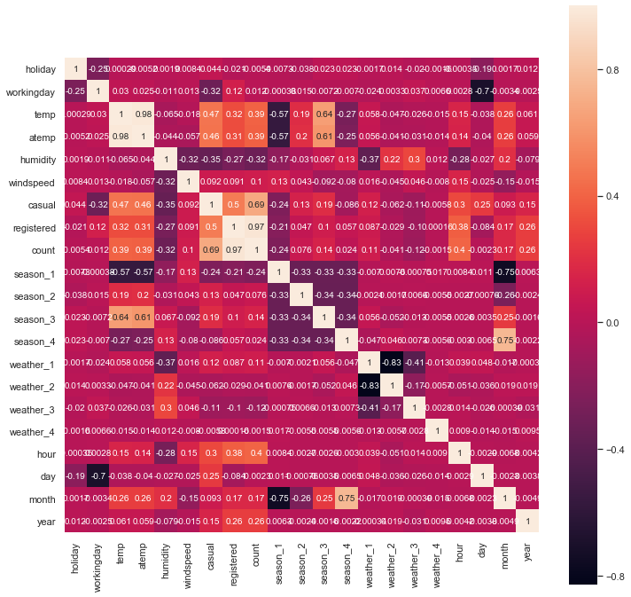


```python
train.drop(['casual','registered'],axis=1,inplace=True)
```


```python
train.head()
```


<div>
<style scoped>
    .dataframe tbody tr th:only-of-type {
        vertical-align: middle;
    }

    .dataframe tbody tr th {
        vertical-align: top;
    }

    .dataframe thead th {
        text-align: right;
    }
</style>
<table border="1" class="dataframe">
  <thead>
    <tr style="text-align: right;">
      <th></th>
      <th>holiday</th>
      <th>workingday</th>
      <th>temp</th>
      <th>atemp</th>
      <th>humidity</th>
      <th>windspeed</th>
      <th>count</th>
      <th>season_1</th>
      <th>season_2</th>
      <th>season_3</th>
      <th>season_4</th>
      <th>weather_1</th>
      <th>weather_2</th>
      <th>weather_3</th>
      <th>weather_4</th>
      <th>hour</th>
      <th>day</th>
      <th>month</th>
      <th>year</th>
    </tr>
  </thead>
  <tbody>
    <tr>
      <th>0</th>
      <td>0</td>
      <td>0</td>
      <td>9.84</td>
      <td>14.395</td>
      <td>81</td>
      <td>0.0</td>
      <td>16</td>
      <td>1</td>
      <td>0</td>
      <td>0</td>
      <td>0</td>
      <td>1</td>
      <td>0</td>
      <td>0</td>
      <td>0</td>
      <td>0</td>
      <td>5</td>
      <td>1</td>
      <td>0</td>
    </tr>
    <tr>
      <th>1</th>
      <td>0</td>
      <td>0</td>
      <td>9.02</td>
      <td>13.635</td>
      <td>80</td>
      <td>0.0</td>
      <td>40</td>
      <td>1</td>
      <td>0</td>
      <td>0</td>
      <td>0</td>
      <td>1</td>
      <td>0</td>
      <td>0</td>
      <td>0</td>
      <td>1</td>
      <td>5</td>
      <td>1</td>
      <td>0</td>
    </tr>
    <tr>
      <th>2</th>
      <td>0</td>
      <td>0</td>
      <td>9.02</td>
      <td>13.635</td>
      <td>80</td>
      <td>0.0</td>
      <td>32</td>
      <td>1</td>
      <td>0</td>
      <td>0</td>
      <td>0</td>
      <td>1</td>
      <td>0</td>
      <td>0</td>
      <td>0</td>
      <td>2</td>
      <td>5</td>
      <td>1</td>
      <td>0</td>
    </tr>
    <tr>
      <th>3</th>
      <td>0</td>
      <td>0</td>
      <td>9.84</td>
      <td>14.395</td>
      <td>75</td>
      <td>0.0</td>
      <td>13</td>
      <td>1</td>
      <td>0</td>
      <td>0</td>
      <td>0</td>
      <td>1</td>
      <td>0</td>
      <td>0</td>
      <td>0</td>
      <td>3</td>
      <td>5</td>
      <td>1</td>
      <td>0</td>
    </tr>
    <tr>
      <th>4</th>
      <td>0</td>
      <td>0</td>
      <td>9.84</td>
      <td>14.395</td>
      <td>75</td>
      <td>0.0</td>
      <td>1</td>
      <td>1</td>
      <td>0</td>
      <td>0</td>
      <td>0</td>
      <td>1</td>
      <td>0</td>
      <td>0</td>
      <td>0</td>
      <td>4</td>
      <td>5</td>
      <td>1</td>
      <td>0</td>
    </tr>
  </tbody>
</table>
</div>


**시간데이터별 자전거대여량**
 - 시간별로는 주간에 대여량이 많음
 - 월 별로는 하절기에 대여량이 많음
 - 년도 별로는 2011년 보다 2012년에 대여량이 많음
 - 요일별로는 균일한 대여량을 보이고 있음


```python
sns.factorplot(x="hour",y="count",data=train,kind='bar',size=5,aspect=1.5)
```

    C:\ProgramData\Anaconda3\lib\site-packages\seaborn\categorical.py:3666: UserWarning: The `factorplot` function has been renamed to `catplot`. The original name will be removed in a future release. Please update your code. Note that the default `kind` in `factorplot` (`'point'`) has changed `'strip'` in `catplot`.
      warnings.warn(msg)
    C:\ProgramData\Anaconda3\lib\site-packages\seaborn\categorical.py:3672: UserWarning: The `size` paramter has been renamed to `height`; please update your code.
      warnings.warn(msg, UserWarning)
    


    <seaborn.axisgrid.FacetGrid at 0xbcebc18>


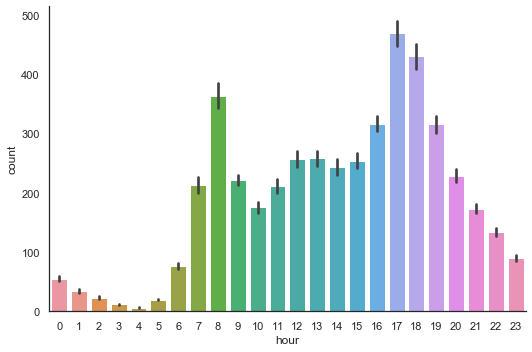


```python
sns.factorplot(x="month",y="count",data=train,kind='bar',size=5,aspect=1.5)
```


    <seaborn.axisgrid.FacetGrid at 0xcf7b748>


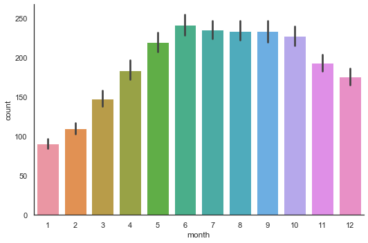


```python
sns.factorplot(x="year",y="count",data=train,kind='bar',size=5,aspect=1.5)
```


    <seaborn.axisgrid.FacetGrid at 0xbdff1d0>


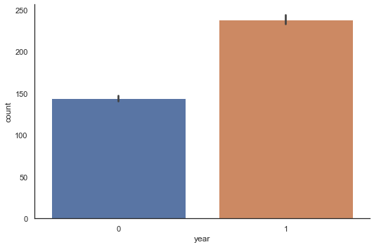


```python
sns.factorplot(x="day",y="count",data=train,kind='bar',size=5,aspect=1.5)
```


    <seaborn.axisgrid.FacetGrid at 0xbe11160>


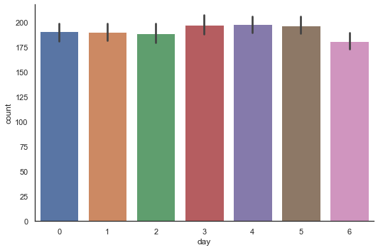


```python
new_df=train.copy()
new_df.temp.describe()
new_df['temp_bin']=np.floor(new_df['temp'])//5
new_df['temp_bin'].unique()
sns.factorplot(x="temp_bin",y="count",data=new_df,kind='bar')
```


    <seaborn.axisgrid.FacetGrid at 0xc374518>


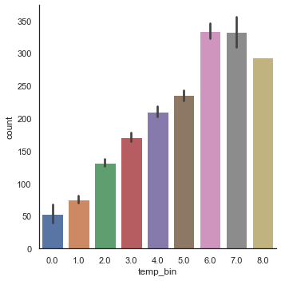


## Modeling
 - R2 score 기준으로 randomforest regressor와 BaggingRegressor가 가장 성능이 좋음


```python
x_train,x_test,y_train,y_test=train_test_split(train.drop('count',axis=1),train['count'],test_size=0.25,random_state=42)
```


```python
models=[LinearRegression(),Ridge(),Lasso(),RidgeCV(),RandomForestRegressor(),BaggingRegressor(),GradientBoostingRegressor(),AdaBoostRegressor(),KNeighborsRegressor()]
model_names=['LinearRegression','Ridge','Lasso','RidgeCV','RandomForestRegressor','BaggingRegressor','GradientBoostingRegressor','AdaBoostRegressor','KNeighborsRegressor']
r2_=[]
d={}
for model in range (len(models)):
    clf=models[model]
    clf.fit(x_train,y_train)
    test_pred=clf.predict(x_test)
    r2_.append(r2_score(test_pred,y_test))
d={'Model Name':model_names,'R2_score':r2_}   

```

    C:\ProgramData\Anaconda3\lib\site-packages\sklearn\ensemble\forest.py:245: FutureWarning: The default value of n_estimators will change from 10 in version 0.20 to 100 in 0.22.
      "10 in version 0.20 to 100 in 0.22.", FutureWarning)
    


```python
d
```


    {'Model Name': ['LinearRegression',
      'Ridge',
      'Lasso',
      'RidgeCV',
      'RandomForestRegressor',
      'BaggingRegressor',
      'GradientBoostingRegressor',
      'AdaBoostRegressor',
      'KNeighborsRegressor'],
     'R2_score': [-0.5299895449212544,
      -0.5303523755272195,
      -0.5739139883029121,
      -0.5328174507184282,
      0.942893526181168,
      0.9462715301511304,
      0.8141191453362169,
      0.45236566960986446,
      0.3327612803989073]}


```python
r2_df = pd.DataFrame(d)
```


```python
sns.factorplot(y='Model Name',x='R2_score',data=r2_df,kind='bar',size=5,aspect=2)
```

    C:\ProgramData\Anaconda3\lib\site-packages\seaborn\categorical.py:3666: UserWarning: The `factorplot` function has been renamed to `catplot`. The original name will be removed in a future release. Please update your code. Note that the default `kind` in `factorplot` (`'point'`) has changed `'strip'` in `catplot`.
      warnings.warn(msg)
    C:\ProgramData\Anaconda3\lib\site-packages\seaborn\categorical.py:3672: UserWarning: The `size` paramter has been renamed to `height`; please update your code.
      warnings.warn(msg, UserWarning)
    


    <seaborn.axisgrid.FacetGrid at 0xc4438d0>


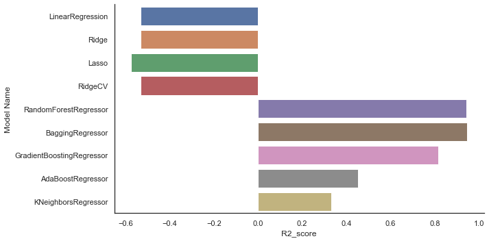


```python
g = sns.factorplot(y='R2_score',x='Model Name',data=r2_df,kind='point',size=5,aspect=2)
g.set_xticklabels(rotation=30)
```


    <seaborn.axisgrid.FacetGrid at 0xd045fd0>


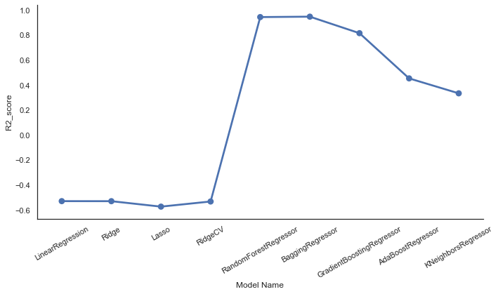


```python
rf = RandomForestRegressor()
rf.fit(x_train,y_train)
pred = rf.predict(x_test)
print(r2_score(y_test, pred))
```

    C:\ProgramData\Anaconda3\lib\site-packages\sklearn\ensemble\forest.py:245: FutureWarning: The default value of n_estimators will change from 10 in version 0.20 to 100 in 0.22.
      "10 in version 0.20 to 100 in 0.22.", FutureWarning)
    

    0.9474355495474962
    

## Test Data 예측


```python
prediction = rf.predict(test)
```


```python
prediction
```


    array([ 10.5,   4.5,   4.1, ..., 169.8, 111.5,  65.4])


```python
submission = pd.read_csv('sampleSubmission.csv')
```


```python
submission['count'] = prediction
```


```python
submission.to_csv('submission.csv',index=False)
```


```python

```
